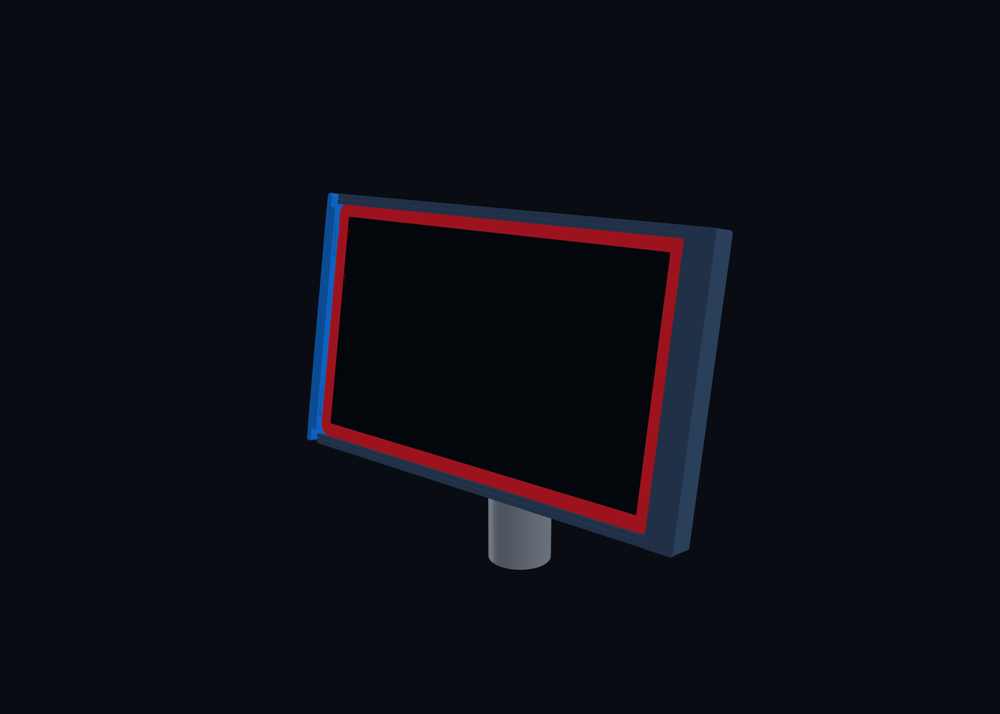

# 3DM Tablet Stand

A 3D-printable, pedestal-mounted holder for a 2024 onn. 8-inch tablet. The holder is intended to slide onto an existing vertical 32 mm OD tube and present the tablet in landscape orientation at a kiosk-like 10 degrees back from vertical (80 degrees above horizontal).

The source tablet mesh and visual references are preserved under [`reference/`](reference/). The always-loaded project rules are in [`AGENTS.md`](AGENTS.md); the active specification, decision history, and validation workflow are indexed in [`docs/`](docs/README.md). The active support-minimized V2 is generated under [`build/v2/`](build/v2/), while V1 remains reproducible under [`build/v1/`](build/v1/).



## Locked design inputs

- Tablet envelope from the supplied OBJ: **200 x 123 x 8.4 mm**.
- Landscape orientation; USB-C is centered on the right short edge as viewed from the screen side.
- Existing support: **32 mm OD vertical tube**.
- Proven printed fit: **32.2 mm ID closed sleeve**, installed by sliding the holder down over the tube end.
- Screen angle: **10 degrees back from vertical / 80 degrees above horizontal**, with the near/bottom edge lower and the far/top edge higher and farther from the user.
- Styling: simple and sleek, with sturdy support but minimal enclosure.
- Retention direction: slide-in edge rails with a removable one-screw end stop using M3 hardware.
- Cable: a slim plug protrudes 0.256 in (6.50 mm) from the tablet; its flat cable section is 0.6 mm thick for roughly 2 in before transitioning to confirmed 3.45 mm round braided cable.
- USB-C handling: the right-angle pigtail turns immediately behind the tablet; its connection and downstream cable stay largely hidden across the open back before entering an open groove/clip on the tube sleeve.

## Repository layout

```text
docs/                 Design decisions and open measurements
docs/README.md        Documentation entrypoint
docs/current-design.md Canonical active design specification
docs/decision-log.md  Chronological record of confirmed and revised decisions
cad/                  Parametric CadQuery source
scripts/              Build validation and direct CAD preview tooling
build/v1/             STEP, STL, parameters, and rendered previews
build/v2/             Active modular STEP, print STLs, parameters, and previews
reference/images/     Uploaded visual references
reference/tablet/     Supplied OBJ and material file
```

## Build the concepts

The current project environment uses Python 3.12 with CadQuery 2.8.0. From an environment containing the packages in `requirements.txt`:

```bash
python cad/tablet_stand_v1.py
python scripts/validate_model.py
python scripts/render_cadquery_preview.py
python cad/tablet_stand_v2.py
python scripts/validate_model_v2.py
python scripts/render_cadquery_preview_v2.py
```

## Current status

1. Source material and the reproducible V1 concept remain preserved.
2. V2 splits the cradle, rear tilt bracket, and sleeve onto support-friendly print datums.
3. Two keyed adhesive joints assemble the main body; print the shared alignment-key STL twice.
4. All V2 STL files are watertight single solids and the installed geometry preserves the confirmed V1 fit dimensions.
5. A right-side production-geometry coupon is provided to verify the tablet rails and actual USB-C route before committing to the full cradle.
