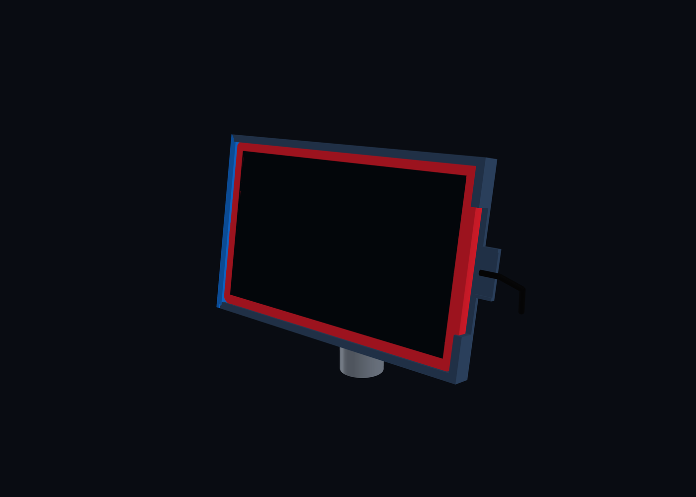

# 3DM Tablet Stand

A 3D-printable, pedestal-mounted holder for a 2024 onn. 8-inch tablet. The holder is intended to slide onto an existing vertical 32 mm OD tube and present the tablet in landscape orientation at a kiosk-like 10 degrees back from vertical (80 degrees above horizontal).

The source tablet mesh and visual references are preserved under [`reference/`](reference/), and the decisions from the initial design conversation are recorded in [`docs/design-brief.md`](docs/design-brief.md). A parametric first concept is available under [`cad/`](cad/) with generated print and preview artifacts in [`build/v1/`](build/v1/).



## Locked design inputs

- Tablet envelope from the supplied OBJ: **200 x 123 x 8.4 mm**.
- Landscape orientation; USB-C is centered on the right short edge as viewed from the screen side.
- Existing support: **32 mm OD vertical tube**.
- Proven printed fit: **32.2 mm ID closed sleeve**, installed by sliding the holder down over the tube end.
- Screen angle: **10 degrees back from vertical / 80 degrees above horizontal**, with the near/bottom edge lower and the far/top edge higher and farther from the user.
- Styling: simple and sleek, with sturdy support but minimal enclosure.
- Retention direction: slide-in edge rails with a removable one-screw end stop using M3 hardware.
- Cable: a slim plug protrudes 0.256 in (6.50 mm) from the tablet; its flat cable section is 0.6 mm thick for roughly 2 in before transitioning to braided cable.

## Repository layout

```text
docs/                 Design decisions and open measurements
docs/decision-log.md  Chronological record of confirmed and revised decisions
cad/                  Parametric CadQuery source
scripts/              Direct CAD preview and optional Blender renderers
build/v1/             STEP, STL, parameters, and rendered previews
reference/images/     Uploaded visual references
reference/tablet/     Supplied OBJ and material file
```

## Build the concept

The current project environment uses Python 3.12 with CadQuery 2.8.0. From an environment containing the packages in `requirements.txt`:

```bash
python cad/tablet_stand_v1.py
python scripts/render_cadquery_preview.py
```

## Current status

1. Source material and design brief preserved.
2. Parametric version 1 CAD and preview generated.
3. Next: review the form, verify hardware and obstruction zones, then test-print critical interfaces before a full-size print.
