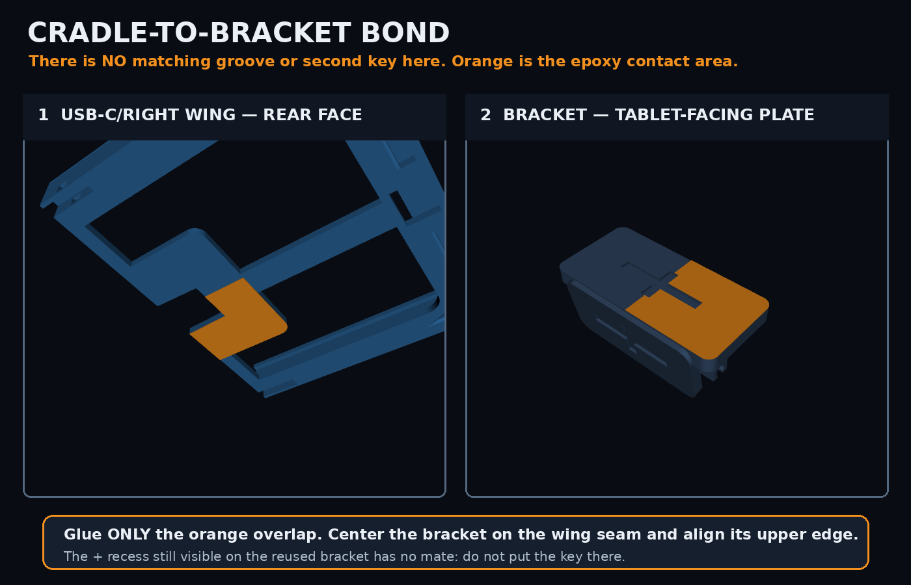
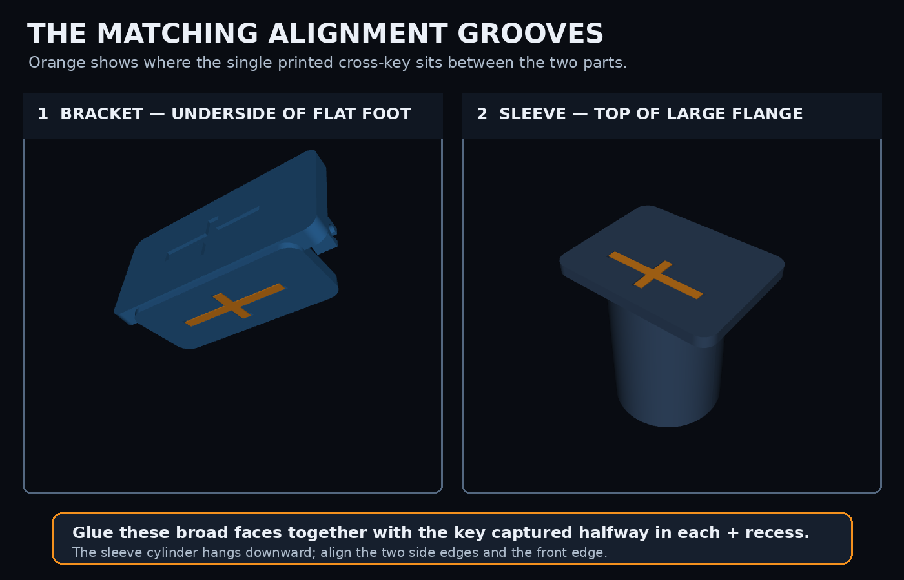

# V3 Assembly

## Cradle-to-bracket bond

There is **no matching groove and no alignment key** between the cradle and bracket in V3. The reused bracket may still show its historical `+` recess, but the right wing intentionally has no matching recess. Do not put the printed key there.

Bond the orange contact areas shown above: the bracket's angled plate bonds only to the flat rear center plate of the fixed USB-C/right wing. Center the bracket on the wing seam and align its upper edge. Keep all adhesive off the removable left wing even though the bracket spans behind and may touch it.

## Bracket-to-sleeve keyed bond

The cradle does not attach directly to the sleeve. The rear tilt bracket joins them.

1. Find the cross-shaped recess on the **underside of the bracket's 60 × 28 mm flat foot**.
2. Find the matching cross-shaped recess on the **top of the sleeve's 60 × 46 mm flange**. In the installed orientation, the sleeve cylinder hangs downward from this flange.
3. Dry-fit the single printed 35 × 15 × 1.8 mm cross-key between those recesses. It is intentionally loose: it aligns the parts while adhesive carries the finished joint.
4. Align the bracket foot with the sleeve flange's two side edges and front edge. The flange intentionally projects farther behind the bracket.
5. For PLA, lightly roughen the broad mating faces, clean them with isopropyl alcohol, and bond them with a thin layer of two-part epoxy. Keep adhesive out of the sleeve bore and cable channel. Clamp without distorting the parts and allow the adhesive's full labeled cure.
6. The separate cradle-to-bracket bond is the unkeyed joint shown at the top of this page.

Do not put adhesive on the tablet, removable left wing, tongues, receivers, locking wedge, sleeve bore, or cable channel.

If either printed mating face has no visible cross-shaped recess, stop rather than forcing the key; photograph both broad faces to determine whether first-layer fill or the wrong part orientation is hiding it.

## Loading the tablet

1. After both structural bonds have fully cured, slide the sleeve down over the accessible tube end.
2. Seat the tablet's USB-C/right edge in the fixed right wing.
3. Slide the enclosed left wing toward the right until all three tongues reach their closed receiver seats.
4. Insert the tapered cross-wedge through the lower transverse channel.
5. To remove the tablet, pull the wedge and slide the left wing away from the right wing.
